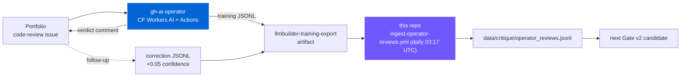
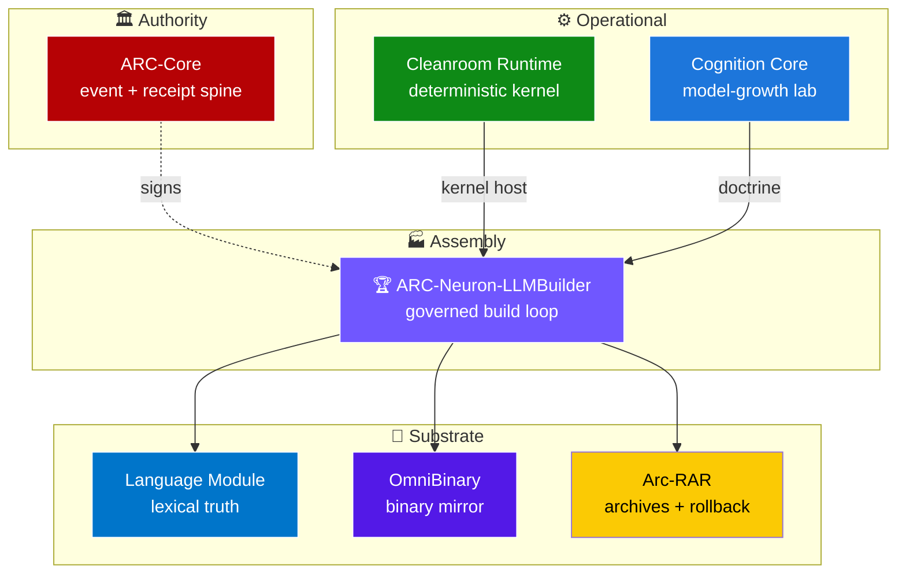
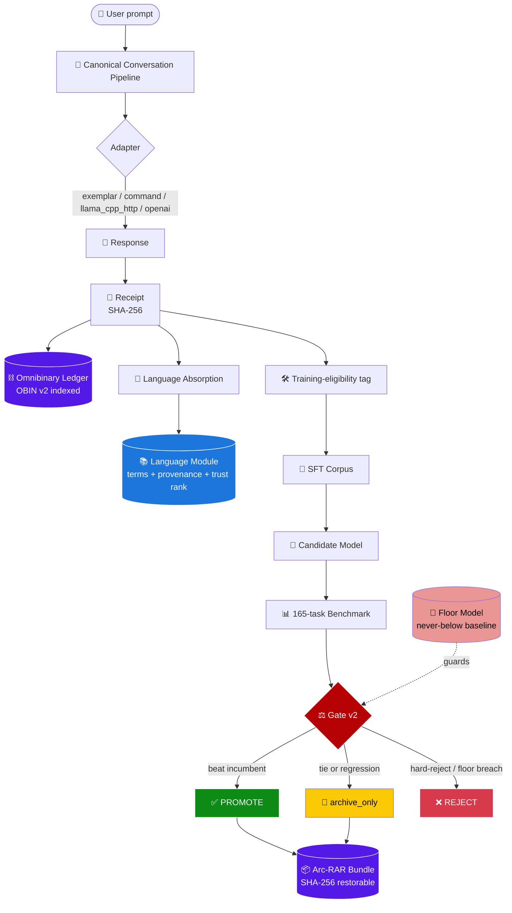
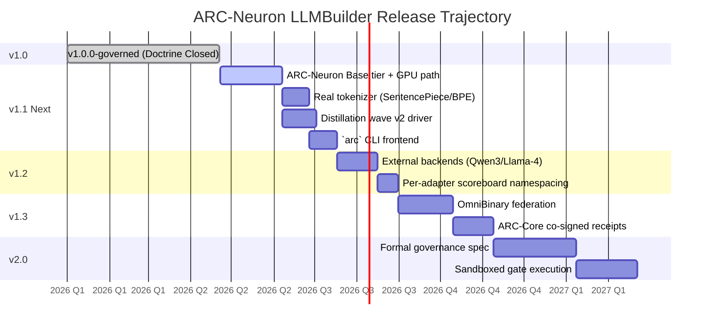
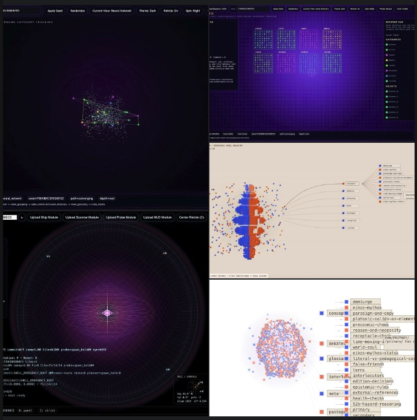

# ARC-Neuron LLMBuilder

**A governed local AI build-and-memory system — train small language models, measure them, promote the better ones through a regression-aware gate, and keep every decision restorable.**

> **AI / vibe-coder briefing:** Before using AI coding assistants or vibe-coding against this repo, read [`docs/AI_BRIEFING_FOR_VIBE_CODERS.md`](docs/AI_BRIEFING_FOR_VIBE_CODERS.md). It defines the ARC standards for lineage preservation, local-first development, receipts, benchmark honesty, ProtoSynth integration, and the 1.0+ → 3.0 licensing path.


> Local-first. Evidence-backed. Promotion-gated. Rollback-safe. Part of the seven-repo ARC ecosystem.

> 🖥️ **Built, tested, and verified on a 2012 Intel Mac running macOS Catalina.** If it runs there, it runs anywhere. The three governed promotions, the 87-test suite, the Omnibinary throughput numbers, and the 9-step proof workflow were all produced on 12-year-old consumer hardware with a pre-Retina Intel CPU. No GPU. No cloud. No accelerator. Just Python and a lot of discipline.

<sub>**Topics**: local AI

[](./LICENSE)
[](https://www.python.org/downloads/)
[](./tests)
[](./specs/promotion_gate_v2.yaml)
[](./RELEASE_NOTES_v1.0.0.md)
[](https://github.com/sponsors/GareBear99)
[](./ECOSYSTEM.md)
[](https://github.com/GareBear99/ARC-Neuron-LLMBuilder/discussions)
[](./PROOF.md#hardware-provenance)
[](./STORAGE_ECONOMICS.md)

## Table of contents

- [Live deployment — continuous-learning AI operative](#live-deployment--continuous-learning-ai-operative)
- [Operator evidence log](./docs/OPERATOR_EVIDENCE.md)
- [What this is](#what-this-is)
- [The ARC Ecosystem](#the-arc-ecosystem)
- [Roadmap, open review window, and 3.0 license direction](#roadmap-open-review-window-and-30-license-direction)
- [Language Module and lexical intelligence direction](#language-module-and-lexical-intelligence-direction)
- [ProtoSynth Integration Path](#protosynth-integration-path)
- [Support this work](#support-this-work)
- [What it does, in plain English](#what-it-does-in-plain-english)
- [Current state](#current-state)
- [Quick start](#quick-start)
- [Architecture at a glance](#architecture-at-a-glance)
- [The governance doctrine](#the-governance-doctrine)
- [Benchmark surface](#benchmark-surface)
- [Repository layout](#repository-layout)
- [One-command operations](#one-command-operations)
- [Proof runners](#proof-runners)
- [Documentation](#documentation)
- [Community](#community)
- [Status and scope](#status-and-scope)
- [Citation](#citation)
- [License](#license)

---

## 🤖 Live deployment — continuous-learning AI operative

**A real AI operative feeds this corpus every day.** The [ARC GitHub AI Operator](https://github.com/GareBear99/gh-ai-operator) answers code-review issues on the [Portfolio](https://github.com/GareBear99/Portfolio) via [Cloudflare Workers AI](https://github.com/GareBear99/gh-ai-operator/blob/main/cloudflare/README.md), posts a verdict back on the issue, and emits every production review as a supervised training example in this repo's seed-examples schema. The nightly workflow `ingest-operator-reviews.yml` pulls those artifacts into `data/critique/operator_reviews.jsonl`, dedupes by id, and bumps human-correction records (from Portfolio Follow-up issues) by +0.05 confidence so Gate v2 weights them higher.



Nothing auto-promotes to the curated `seed_examples.jsonl` — ingested data stays in a separate shard so a human curator keeps the final call. Full pipeline: [docs/LIVE_DEPLOYMENT_LEARNING.md](./docs/LIVE_DEPLOYMENT_LEARNING.md). Activation is one secret: `OPERATOR_READ_TOKEN` (PAT with `Actions: Read` on `GareBear99/gh-ai-operator`).

**Live-run evidence**: [docs/OPERATOR_EVIDENCE.md](./docs/OPERATOR_EVIDENCE.md) — chronological log of real runs. First entry (FreeEQ8, Portfolio issue #1) documents the verdict, the JSONL shape, and the ingest manifest with no code changes required to accept it.

---

<a id="what-this-is"></a>
## What this is

ARC-Neuron LLMBuilder is a local-first cognition lab that treats a language model as one artifact inside a **governed lifecycle**. You don't just train a model — you train a candidate, measure it, compare it to the current incumbent, and promote it only if it genuinely improves without regressing on guarded capabilities. Every decision leaves receipts. Every candidate is restorable. Every archive ties back to the source truth through an indexed binary ledger.

The system ships with a working transformer family (ARC-Neuron Tiny and Small), a retrieval-based exemplar adapter, a canonical conversation pipeline, draft→critique→revise reflection, automatic terminology absorption from conversation, and a regression-aware promotion gate.

**Doctrine closed in v1.0.0-governed:** conversation grows the brain, not just the memory. Three governed promotions in a row have been recorded, the last one (`arc_governed_v6_conversation`) trained entirely from a corpus the canonical conversation pipeline harvested itself.

---

## 🌐 The ARC Ecosystem

ARC-Neuron LLMBuilder is **one of seven repositories** in the ARC governed-AI ecosystem. Each repo owns a single frozen role; together they form a local-first AI operating system with full lineage, receipts, and rollback.



Brief tour of each (full writeups in [ECOSYSTEM.md](./ECOSYSTEM.md)):

### [ARC-Core](https://github.com/GareBear99/ARC-Core) — authoritative event-and-receipt engine
The root authority. Every state change across the system is modeled as an event with a proposal, evidence, an authority, a receipt, and a SHA-256 hash. This is how the ecosystem proves *something actually happened*. It also carries the signal-intelligence event-graph primitives (cases, watchlists, risk scoring) that give operators a structured way to organize investigations over the event stream.

### [arc-lucifer-cleanroom-runtime](https://github.com/GareBear99/arc-lucifer-cleanroom-runtime) — deterministic execution kernel
The deterministic shell the rest of the system eventually runs inside. Event-sourced `KernelEngine` with an append-only log, policy evaluation, branch planning, point-in-time `state_at(event_id)` replay, SQLite backup, directive continuity across restarts. LLMs are stochastic; Cleanroom is the deterministic substrate that makes the rest of the system reproducible.

### [arc-cognition-core](https://github.com/GareBear99/arc-cognition-core) — cognition build-and-benchmark lab
The upstream home of the cognition doctrine: candidate shaping (SFT / preference / merge / export), GGUF-oriented evaluation, promotion gate v1 (what LLMBuilder's Gate v2 evolved from), MCP-style tool descriptors, run manifests, experiment tracking, release bundle generation. Defines what "a cognition candidate" means.

### [arc-language-module](https://github.com/GareBear99/arc-language-module) — governed multilingual language backend
The authoritative store for what a word means, how it is spelled, what it maps to across languages, and where each of those facts came from. Governed ingestion with provenance + trust rank, readiness/gap states, self-fill orchestration with approval gates, contradiction arbitration, release pipelines with replayable snapshots. 40+ internal services. Treats words as first-class governed records, not strings.

### [omnibinary-runtime](https://github.com/GareBear99/omnibinary-runtime) — native-first binary intake and runtime ledger
Applies the receipt economy to binaries. Intake + classification + deterministic decoding of executables, libraries, GGUF weights, ANCF artifacts. Federated execution lanes (managed / native / DBT) each with their own policy and receipts. JIT via Cranelift and LLVM. Cache-integrity-before-speed policy. Rust crates: `obi-core`, `obi-cache`, `obi-intake`, `obi-jit-*`, `obi-lane-*`, `obi-receipts`, and more.

### [Arc-RAR](https://github.com/GareBear99/Arc-RAR) — governed archive and rollback
CLI-first archive manager with a native-app control surface (Linux GTK, macOS, Windows WinUI). Bundles are manifest-indexed and SHA-256-verified; the manifest is readable without extracting. Extraction is evidence-producing — every restore leaves a receipt. Automation crate, FFI crate, IPC crate for daemon mode. Any archived state is addressable by SHA-256; rollback is first-class, not a recovery special case.

### ARC-Neuron-LLMBuilder *(this repo)* — governed build loop
Assembly of the other six into a working train → benchmark → gate → archive → verify cycle. Canonical conversation pipeline, Gate v2 promotion, floor model, reflection loop, language absorption, OBIN v2 indexed ledger, Arc-RAR bundle packaging. Three governed promotions on record (v4, v5, v6_conversation). 87 tests. 165-task benchmark suite.

Full per-repo writeups, integration flow, and role contract: **[ECOSYSTEM.md](./ECOSYSTEM.md)**

**ARC-Neuron LLMBuilder Current Release:**  
  https://github.com/GareBear99/ARC-Neuron-LLMBuilder

---

## 💖 Support this work

If the governance doctrine, the conversation-driven growth loop, or the evidence-backed promotion pipeline is useful to you or your organization, please consider becoming a sponsor:

[**github.com/sponsors/GareBear99**](https://github.com/sponsors/GareBear99)

Sponsorship funds time across all seven ARC ecosystem repos — not just this one.

---

## 💡 What it does, in plain English

| You do | The system does |
|---|---|
| Talk to it | Records the conversation with a signed receipt, mirrors it into the Omnibinary indexed ledger, extracts terminology with provenance |
| Ask it to train a new model | Mines the accumulated SFT corpus, trains a byte-level transformer, exports `.pt` + `.gguf`, builds a retrieval exemplar artifact |
| Ask it to compare | Runs the candidate against the full 165-task benchmark, scores with the task-aware rubric, prints per-capability deltas |
| Ask it to promote | Applies Gate v2 (hard-reject floor, floor-model protection, regression ceilings), updates the scoreboard, bundles the candidate into an Arc-RAR archive |
| Ask it to roll back | Restores a prior incumbent from its bundle; the prior state is always addressable by SHA-256 |
| Ask it to prove itself | Runs `demo_proof_workflow.py` or `run_n_cycles.py` — every step produces a receipt |

---

## 📊 Current state

<table>
<tr>
<td width="50%">

### 🟢 Operational

- **✅ Tests**: 87 / 87 passing
- **🏆 Incumbent**: `arc_governed_v6_conversation`
- **📈 Score**: **0.7333** on 165 tasks
- **📚 Docs**: 21 root + 62 indexed
- **📦 Bundles**: 12 restorable
- **💾 Pipeline**: Canonical, single-path

</td>
<td width="50%">

### ⚡ Performance (measured)

- **✍️ Append**: **6,639 ev/sec**
- **🔎 Lookup**: **8,859 O(1) ops/sec**
- **📐 p99 latency**: **0.22 ms**
- **💾 Per-event**: **397 bytes**
- **🗄️ Per TB**: **~2.71 billion events**
- **📍 Fidelity**: SHA-256 stable ✅

</td>
</tr>
</table>

### 🎯 Promotion lineage

```
v1 (0.6122)  →  v2 (0.6247)  →  v4 (0.7128)  →  v5 (0.7169)  →  v6_conversation (0.7333)  🏆
   promote         promote         promote         promote         promote / INCUMBENT
                                   +16.4% vs v2 baseline on the same 165-task benchmark
```

Plus: **v6 tied ⇒ archive_only** · **v7_regressed caught ⇒ archive_only with attribution** · **5/5 STABLE** at v5 floor.

All four Gate v2 decision states have fired lawfully on real runs. Every claim above is individually verifiable:

- 🔬 [PROOF.md](./PROOF.md) — every number with its receipt and verification command
- 💾 [STORAGE_ECONOMICS.md](./STORAGE_ECONOMICS.md) — year-long projections + ChatGPT / Claude / Gemini comparison
- 📜 [RELEASE_NOTES_v1.0.0.md](./RELEASE_NOTES_v1.0.0.md) — full release dossier

---

## 🚀 Quick start

### 1. Install

#### Option A — pip (Python 3.10+)

```bash
git clone https://github.com/GareBear99/ARC-Neuron-LLMBuilder.git
cd ARC-Neuron-LLMBuilder

python3.12 -m venv .venv
source .venv/bin/activate
pip install -e ".[training]"         # installs core + torch + numpy
python3 scripts/ops/bootstrap_keys.py
```

#### Option B — Docker (zero setup)

```bash
git clone https://github.com/GareBear99/ARC-Neuron-LLMBuilder.git
cd ARC-Neuron-LLMBuilder
docker build -t arc-neuron-llmbuilder .
docker run --rm arc-neuron-llmbuilder python3 scripts/ops/demo_proof_workflow.py
```

### 2. Validate

```bash
python3 -m pytest tests/ -q              # 87 tests
python3 scripts/ops/benchmark_omnibinary.py   # measures the ledger
python3 scripts/ops/demo_proof_workflow.py    # 9-step end-to-end proof
```

### 3. Use the incumbent model

**Shortest possible — one line:**

```bash
python3 examples/hello.py "Critique a plan that ships without a rollback path."
```

**Full CLI equivalent:**

```bash
python3 scripts/execution/run_direct_candidate.py \
  --adapter exemplar \
  --artifact exports/candidates/arc_governed_v6_conversation/exemplar_train/exemplar_model.json \
  --prompt "Critique a plan that ships without a rollback path."
```

### 4. Train your own candidate

```bash
# Train a new candidate against the current corpus
python3 scripts/training/train_arc_native_candidate.py \
  --candidate my_candidate_v1 --tier small --steps 300

# Benchmark it
python3 scripts/execution/run_model_benchmarks.py \
  --adapter exemplar \
  --artifact exports/candidates/my_candidate_v1/exemplar_train/exemplar_model.json \
  --output results/my_candidate_v1_outputs.jsonl

# Score it
python3 scripts/execution/score_benchmark_outputs.py \
  --input results/my_candidate_v1_outputs.jsonl \
  --output results/my_candidate_v1_scored.json

# Submit to Gate v2 — promote, archive-only, or reject with reasons
python3 scripts/execution/promote_candidate.py \
  --scored results/my_candidate_v1_scored.json \
  --model-name my_candidate_v1 \
  --candidate my_candidate_v1
```

### 5. Run the full governed loop

```bash
make full-loop       # train → benchmark → score → gate → bundle → verify
make pipeline        # run one conversation through the canonical path
make verify-store    # check Omnibinary integrity
```

---

## 🏗️ Architecture at a glance



**Four layers, frozen roles**:

- **Language Module** — living truth spine. Stores terms with provenance, trust ranks, and contradiction flags. Grows from every conversation.
- **Runtime** — persistent operator shell. Canonical conversation pipeline, reflection loop, language absorption, continuity state.
- **Cognition Core** — build-and-benchmark lab. Native training, exemplar adapter, benchmark harness, scoring rubric, promotion gate.
- **Archive** — Arc-RAR bundles for restorable lineage. Omnibinary ledger for O(1) indexed event history. ANCF for canonical model artifacts.

See [ARCHITECTURE.md](./ARCHITECTURE.md) and [GOVERNANCE_DOCTRINE.md](./GOVERNANCE_DOCTRINE.md) for the full map.

---

## ⚖️ The governance doctrine

Every candidate must clear **Gate v2** before displacing an incumbent:

1. **Hard-reject floor** — `repair_success` ≥ 0.30, `failure_rate` ≤ 0.25
2. **Floor model check** — core capabilities cannot drop below the locked baseline (currently v6_conversation)
3. **Regression ceilings** — no guarded capability may drop more than its per-capability allowance vs the incumbent
4. **Beat the incumbent** on overall weighted score
5. **Non-promotable adapter filter** — heuristic/echo adapters can never become incumbents

Outcomes are one of: **promote**, **archive_only**, or **reject**. Every outcome produces a receipt. `archive_only` and `reject` never displace the current incumbent. `promote` bundles the winning candidate via Arc-RAR, preserving the full lineage.

Full spec: [specs/promotion_gate_v2.yaml](./specs/promotion_gate_v2.yaml), [specs/benchmark_schema_v2.yaml](./specs/benchmark_schema_v2.yaml)

---

## 🗺️ Roadmap

Live roadmap. Updated as milestones ship. Full detail in [ROADMAP.md](./ROADMAP.md).

| Version | Status | Milestone | Key deliverables |
|---|---|---|---|
| **v1.0.0-governed** | ✅ **Shipped** *(2026-04-22)* | **Doctrine Closed** | Three governed promotions, Gate v2 all four states, OBIN v2 indexed ledger, 87-test suite, 165-task benchmark, Arc-RAR bundles |
| **v1.1.0** | 🚧 **Next** | **Expanded Native Lane** | ARC-Neuron Base tier (GPU), real tokenizer (SentencePiece/BPE), distillation wave v2 driver, `arc` CLI frontend, scorer v3 with per-cap weights, +50 benchmark tasks |
| **v1.2.0** | 🔮 Planned | **External Backend Integration** | Reference docs for Qwen3-32B / Llama-4 / DeepSeek via `llama_cpp_http`, per-adapter scoreboard namespacing, command-adapter timeout tuning, reflection loop v2 |
| **v1.3.0** | 🔮 Planned | **Multi-Repo Integration** | OmniBinary ↔ LLMBuilder federation, ARC-Core event attestation (co-signed receipts), Arc-RAR ↔ Cleanroom replay, Language Module canonicalization |
| **v2.0.0** | 🎯 Future | **Production Governance** | Formal governance spec (machine-checkable), sandboxed gate execution, audit-trail export, per-org scoreboards, SOC 2 / ISO 27001 hooks |


### Roadmap, open review window, and 3.0 license direction

ARC-Neuron LLMBuilder is being developed in staged public phases so the path toward the commercial 3.0 system stays transparent, inspectable, and independently useful.

```text
1.0+    public foundation / self-coded baseline / open review
2.0     development bridge / expanded systems / open-source review window
2.1-2.9 unreleased development corridor; public code may appear, but no formal 2.9 release is planned
3.0     commercial base-model milestone / protected license direction for later commercial artifacts
```

The **1.0+ through 2.9 development path** is intentionally available for open-source use, review, learning, auditing, and independent experimentation. That preserves the evidence trail: developers can inspect the validators, benchmark logic, training scaffolding, governance receipts, and design choices that led toward 3.0.

The planned **3.0 milestone** is the first major commercial base-model class direction. At that point, future commercial outputs may move under a more protective license so production weights, packaged systems, and business-facing releases cannot be freely resold, repackaged, or extracted as competing closed products.

```text
The road to 3.0 stays visible.
The commercial product that comes after 3.0 can be protected.
```

This does not retroactively erase the open-source foundation. It separates the independently reviewable development path from later commercial model artifacts and protected production releases.

### Language Module and lexical intelligence direction

ARC-Neuron LLMBuilder is not only a dataset-scaling project. A core direction is to build a stronger language foundation through structured lexical configuration, symbolic grounding, language lineage, mathematics, and cross-language meaning alignment.

The connected ARC Language Module is planned as a canonical language spine covering:

- 35-language lexical configuration
- multilingual word structure and lineage
- orthography, transliteration, and symbol relationships
- mathematical language and notation
- root-word and meaning-family mapping
- symbolic compression of concepts
- reproducible vocabulary growth
- benchmarkable language behavior

Most model improvements are usually framed as dataset expansion: more text, more examples, bigger model, better output. ARC-Neuron is pursuing a different efficiency path:

```text
structured language truth -> lexical compression -> symbol grounding -> lower-weight reasoning -> better output per parameter
```

The goal is to reduce purely synthetic pattern imitation by giving the model a governed lexical spine before and during training. Datasets are still required, but they become training material on top of structured language relationships instead of being the only source of language behavior.

This is why parameter count alone is not the right benchmark for ARC-Neuron. The project should be evaluated by benchmark pass records, lexical coverage, math and symbol handling, local runtime performance, output usefulness per parameter, governance receipts, promotion evidence, and low-weight deployment viability.

The main repository now includes benchmark documentation and validation records that support this direction. The target is not simply “bigger model equals better model.” The target is higher intelligence density: better language structure, better receipts, and a better training path producing more useful output from fewer parameters.

- **[arc-language-module](https://github.com/GareBear99/arc-language-module)** — governed multilingual language backend

- **ARC-Neuron LLMBuilder Current Release:**  
  https://github.com/GareBear99/ARC-Neuron-LLMBuilder


### Progress toward each milestone



### How to influence what ships

- File a [✨ feature request](./.github/ISSUE_TEMPLATE/02_feature_request.yml) tagged with the target version.
- Open a PR that preserves all ten [governance invariants](./GOVERNANCE_DOCTRINE.md).
- [💖 Sponsor](https://github.com/sponsors/GareBear99) to fund maintenance time across the whole ARC ecosystem.
- Discuss architectural direction in [💬 GitHub Discussions](https://github.com/GareBear99/ARC-Neuron-LLMBuilder/discussions).

### Explicitly not on the roadmap

❌ Alignment / safety filtering (orthogonal concern) · ❌ Hosted cloud service (local-first project) · ❌ Closed-source components (MIT all the way down) · ❌ Role inversion (the seven-repo contract is permanent)

---

## 📈 Benchmark surface

165 tasks across 16 capability families:

| Family | Tasks | Current v6 score |
|---|---|---|
| reasoning | 6 | 1.000 |
| planning | 5 | 1.000 |
| compression | 5 | 1.000 |
| paraphrase_stability | 5 | 0.867 |
| calibration | 5 | 0.833 |
| english_understanding | 10 | 0.750 |
| critique | 10 | 0.750 |
| out_of_domain | 10 | 0.750 |
| quantization_retention | 5 | 0.833 |
| repair | 5 | 0.667 |
| arc_neuron_small_v2 | 18 | 0.519 |
| arc_neuron_base | 5 | 0.433 |
| instruction_following | 10 | 0.583 |
| intelligence | 12 | 0.597 |
| continuity | 10 | 0.583 |
| reflection | 10 | 0.567 |

---

## 📂 Repository layout

```
ARC-Neuron-LLMBuilder/
├── arc_core/              # Single canonical transformer implementation
├── arc_tiny/              # Tiny tier (~0.05M params) + GGUF v3 I/O
├── arc_neuron_small/      # Small tier (~0.18M params)
├── arc_neuron_tokenizer/  # Hybrid byte + wordpiece tokenizer builder
├── adapters/              # Model backend abstraction (exemplar, command, llama_cpp_http, openai)
├── runtime/               # Canonical pipeline, reflection, absorption, terminology, floor model
├── scorers/               # Task-aware rubric scorer with 23 capability buckets
├── scripts/
│   ├── training/          # Native training, LoRA routing, corpus prep
│   ├── execution/         # Benchmark, score, promote, candidate gate
│   ├── ops/               # Proof workflows, repeatability runners, distillation waves
│   ├── lab/               # Tiny/Small GGUF smoke and validate
│   └── operator/          # User-facing shell scripts
├── benchmarks/            # 165 tasks across 16 capability families
├── datasets/              # Seed and distilled SFT corpora
├── specs/                 # Gate v2, benchmark schema v2, promotion doctrine
├── configs/               # Base model candidates, training stages, runtime profiles
├── reports/               # Promotion receipts, repeatability reports, benchmark numbers
├── artifacts/             # GGUF models, Arc-RAR bundles, Omnibinary ledger
├── exports/candidates/    # Trained candidate artifacts (per-candidate directories)
├── results/               # Benchmark outputs, scored summaries, scoreboard
├── tests/                 # 87-test suite covering the full loop
└── docs/                  # Extended design documentation (62 markdown files)
```

---

## ⚙️ One-command operations

```bash
make validate          # validate repo structure and required files
make test              # run the 87-test suite
make counts            # count datasets and benchmarks
make candidate-gate    # run the full candidate gate
make native-tiny       # train an ARC-Tiny candidate (~0.05M params)
make native-small      # train an ARC-Small candidate (~0.18M params)
make full-loop         # train → benchmark → score → gate → bundle → verify
make pipeline          # run one conversation through the canonical path
make bootstrap-keys    # generate runtime secrets (idempotent)
make bundle-candidate CANDIDATE=<name>   # Arc-RAR bundle a promoted candidate
make verify-store      # verify Omnibinary ledger integrity
```

---

## 🔬 Proof runners

```bash
# 9-step end-to-end proof: term → conversation → train → benchmark → gate → archive
python3 scripts/ops/demo_proof_workflow.py

# Measure Omnibinary throughput, latency, and fidelity
python3 scripts/ops/benchmark_omnibinary.py

# Run N governed promotion cycles and emit a repeatability verdict
python3 scripts/ops/run_n_cycles.py --cycles 3 --tier small --steps 300

# Generate draft→critique→revise SFT pairs from the incumbent
python3 scripts/ops/generate_reflection_sft.py

# Absorb a conversation session end-to-end into the learning pipeline
python3 scripts/ops/absorb_session.py --text "..." --session-id my_session
```

---

## 📚 Documentation

### Core docs
- [ARCHITECTURE.md](./ARCHITECTURE.md) — the full system map; four frozen roles
- [GOVERNANCE_DOCTRINE.md](./GOVERNANCE_DOCTRINE.md) — Gate v2, floor model, Arc-RAR, Omnibinary explained
- [ECOSYSTEM.md](./ECOSYSTEM.md) — the seven-repo ARC ecosystem and how LLMBuilder integrates
- [QUICKSTART.md](./QUICKSTART.md) — 10-minute tour of every major capability
- [USAGE.md](./USAGE.md) — complete command reference
- [EXAMPLES.md](./EXAMPLES.md) — 10 runnable recipes

### Reference
- [PROOF.md](./PROOF.md) — every claim with its receipt and verification command
- [STORAGE_ECONOMICS.md](./STORAGE_ECONOMICS.md) — measured storage numbers, year-long projections, vs ChatGPT / Claude / Gemini
- [FAQ.md](./FAQ.md) — 20+ searchable questions
- [GLOSSARY.md](./GLOSSARY.md) — every ARC-specific term
- [ROADMAP.md](./ROADMAP.md) — v1.1 → v2.0 milestones
- [COMPARISON.md](./COMPARISON.md) — vs MLflow, W&B, Langfuse, llama.cpp
- [MODEL_CARD_v6_conversation.md](./MODEL_CARD_v6_conversation.md) — current incumbent

### Release
- [CHANGELOG.md](./CHANGELOG.md) — full release history
- [RELEASE_NOTES_v1.0.0.md](./RELEASE_NOTES_v1.0.0.md) — v1.0.0-governed evidence dossier

### Community
- [CONTRIBUTING.md](./CONTRIBUTING.md) — how to contribute
- [CODE_OF_CONDUCT.md](./CODE_OF_CONDUCT.md) — community standards
- [SECURITY.md](./SECURITY.md) — security contact and disclosure
- [`docs/`](./docs/) — 62 extended design docs covering every subsystem (see [docs/README.md](./docs/README.md) for the topic index)

## 👥 Community

- 💬 [GitHub Discussions](https://github.com/GareBear99/ARC-Neuron-LLMBuilder/discussions) — ask questions, share runs, propose directions
- 🐛 [Issues](https://github.com/GareBear99/ARC-Neuron-LLMBuilder/issues) — bug reports, feature requests, gate behavior reports, benchmark contributions
- 🔒 [Security advisories](https://github.com/GareBear99/ARC-Neuron-LLMBuilder/security/advisories/new) — private disclosure
- 💖 [Sponsor](https://github.com/sponsors/GareBear99) — support the ecosystem
- 📦 [Releases](https://github.com/GareBear99/ARC-Neuron-LLMBuilder/releases) — all versions with evidence bundles

---

## 📌 Status and scope

**What this is**: a local-first governed cognition lab and control plane for training, promoting, and archiving small language models with full lineage. The included native models (Tiny and Small) are reference tiers designed to prove the pipeline is real, not to compete with frontier LLMs.

**What this is not**: a frontier-scale LLM. The ARC-Neuron Tiny model is ~0.05M parameters. The Small model is ~0.18M parameters. They are deliberately small because the contribution here is the **governance**, not the raw brain.

**The shell is contender-grade. The brain is the research lane.** The adapter boundary is the integration point: you can plug any local GGUF runtime or HTTP-served model into the existing governance machinery via `adapters/command_adapter.py` or `adapters/llama_cpp_http_adapter.py`.

---


## ProtoSynth Integration Path

ARC-Neuron LLMBuilder v1 is the cognition-building layer of the ARC ecosystem. ProtoSynth is the visual/spatial projection layer that can make those cognition artifacts visible, navigable, and interactive.



- **ARC-Neuron LLMBuilder Current Release:**  
  https://github.com/GareBear99/ARC-Neuron-LLMBuilder

- **ProtoSynth Grid Engine:**  
  https://github.com/GareBear99/Proto-Synth_Grid_Engine

Together, these projects form a practical local-first AI lab loop:

```text
Datasets / prompts / evals
        ↓
ARC-Neuron LLMBuilder
        ↓
trained checkpoints / GGUF targets / scoring receipts
        ↓
ARC governance + archival layers
        ↓
ProtoSynth visual projection
        ↓
interactive spatial cognition interface
```

### How They Work Together

**ARC-Neuron LLMBuilder v1** focuses on the backend intelligence pipeline:

- dataset preparation
- tokenizer and model training experiments
- benchmark and scoring workflows
- local-first model artifact generation
- reproducible evidence trails for model improvement
- groundwork for future GGUF/local runtime deployment

**ProtoSynth** focuses on the front-facing visualization and interaction layer:

- 2D/3D-style grid projection
- node-based cognition visualization
- spatial organization of files, models, datasets, and systems
- visual brain-lab style interaction
- future neural-map views for ARC-Neuron states, evals, receipts, and training progress

### Tandem Usage Vision

The intended workflow is simple: **LLMBuilder produces the intelligence artifacts; ProtoSynth makes those artifacts visible and operable.**

Examples of how the two can be used in tandem:

- training runs from LLMBuilder can be represented as ProtoSynth nodes
- datasets can appear as spatial clusters or voxel directories
- benchmark results can become live visual signals
- stronger model versions can be promoted visually through the grid
- failed runs can be archived, inspected, compared, and restored
- future ARC-Neuron models can connect to ProtoSynth as an embodied visual cognition layer

This creates a path toward a local AI workshop where the operator is not just running scripts, but visually operating a reproducible intelligence system.

### Long-Term ARC Stack Role

```text
ARC-Neuron LLMBuilder = builds the brain
ProtoSynth              = visualizes the brain
ARC Core                = governs the brain
Arc-RAR                 = archives the brain
Omnibinary              = mirrors the brain state
Cleanroom Runtime       = safely executes the brain
```

This makes ARC-Neuron LLMBuilder v1 the first public cognition-building milestone, while ProtoSynth acts as the future spatial UI layer for inspecting and interacting with that cognition in a lightweight, local-first environment.

The v1 release should therefore be viewed not only as a standalone model-building repository, but as the backend foundation for a larger visual AI lab experience powered by ProtoSynth.

---

## 📝 Citation

If you use ARC-Neuron LLMBuilder in research or production, please cite:

```bibtex
@software{arc_neuron_llmbuilder_2026,
  author  = {Doman, Gary},
  title   = {ARC-Neuron LLMBuilder: A Governed Local AI Build-and-Memory System},
  year    = 2026,
  version = {v1.0.0-governed},
  url     = {https://github.com/GareBear99/ARC-Neuron-LLMBuilder}
}
```

Full metadata in [CITATION.cff](./CITATION.cff).

---

## 📜 License

MIT — see [LICENSE](./LICENSE).

---

## 🎯 One-line verdict

**The machine is lawful. The measurement is honest. The loop grows a better brain on demand, preserves the prior one, rejects worse ones with attribution, and does so repeatedly.**
