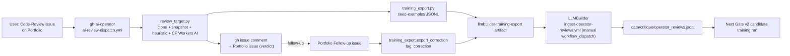

# Live-deployment learning loop

LLMBuilder treats the **[ARC GitHub AI Operator](https://github.com/GareBear99/gh-ai-operator)** as a first-class live deployment whose outputs become training data for the next generation of candidate brains.

This is what the README means by "learns from itself": every code-review the operator does in production becomes a supervised example in the `critique` capability corpus, and every human follow-up on the Portfolio becomes a weighted correction.

## Pipeline



## Data shape

The operator writes JSONL records that match LLMBuilder's existing seed-examples schema exactly, so no translation is needed on ingest.

```json
{
  "id": "arc-operator-<sha10>",
  "capability": "critique",
  "domain": "code",
  "difficulty": "easy | medium | hard",
  "input":  { "task": "Review the public GitHub target <URL>. Requester focus: ..." },
  "target": {
    "analysis":   "<the full markdown review>",
    "confidence": 0.0,
    "verdict":    "🟢 ship | 🟡 feedback | 🔴 redesign | 🟡 low-signal",
    "findings":   ["no license", "no tests", "..."]
  },
  "tags":       ["critique", "arc-operator", "live-deployment", "correction?"],
  "provenance": {
    "source":     "github.com/GareBear99/gh-ai-operator",
    "emitted_at": "<ISO-8601 UTC>",
    "target_url": "<the reviewed URL>"
  }
}
```

## Where the data lives

- **Operator-side** — written into `output/training_export/critique/seed_examples.jsonl` per run and uploaded as the `llmbuilder-training-export` artifact (90-day retention).
- **LLMBuilder-side** — ingested into `data/critique/operator_reviews.jsonl` (kept separate from curated `seed_examples.jsonl` so a human can diff/promote).

## Manual run

```bash
# 1. Download from an operator run
gh run download <run-id> -R GareBear99/gh-ai-operator \
  -n llmbuilder-training-export -D _operator_exports

# 2. Ingest
python scripts/ingest_operator_reviews.py

# 3. Inspect
head -n 2 data/critique/operator_reviews.jsonl
wc -l         data/critique/operator_reviews.jsonl
```

## Correction lane

When a Portfolio Follow-up issue contradicts or amends an operator verdict, the operator emits a **second** JSONL record with the same `target_url`, `suffix='correction'`, and `tags: [..., "correction", "human-follow-up"]`.

The LLMBuilder ingest script recognises the `correction` tag and bumps its confidence by `+0.05` (capped at `1.0`) so Gate v2 training gives those records more weight than the standard live-deployment stream.

## Secrets

- **LLMBuilder → `OPERATOR_READ_TOKEN`** — a PAT with `actions: read` on `GareBear99/gh-ai-operator` so the manual workflow can `gh run download` artifacts. Graceful no-op when unset.
- All other secrets (CF Workers AI creds, Portfolio write token, etc.) live with the operator.

## Safety model

- Only **public** operator runs are ingested; anything private never leaves the operator's sandbox.
- The `operator_reviews.jsonl` shard is **separate** from `seed_examples.jsonl`; nothing auto-promotes into the canonical seed file. A human curator diffs and promotes at their discretion.
- Every record carries `provenance.source` + `provenance.emitted_at` + `provenance.target_url` for full traceability — Gate v2 can filter / slice the corpus by any of them.

## Why this matters

The operator is acting as a real AI helper in production. Every real interaction produces signal. Without this loop that signal evaporates; with it, LLMBuilder's next-generation candidate has a living corpus of "what code review actually looks like for the ARC ecosystem" that grows automatically.
