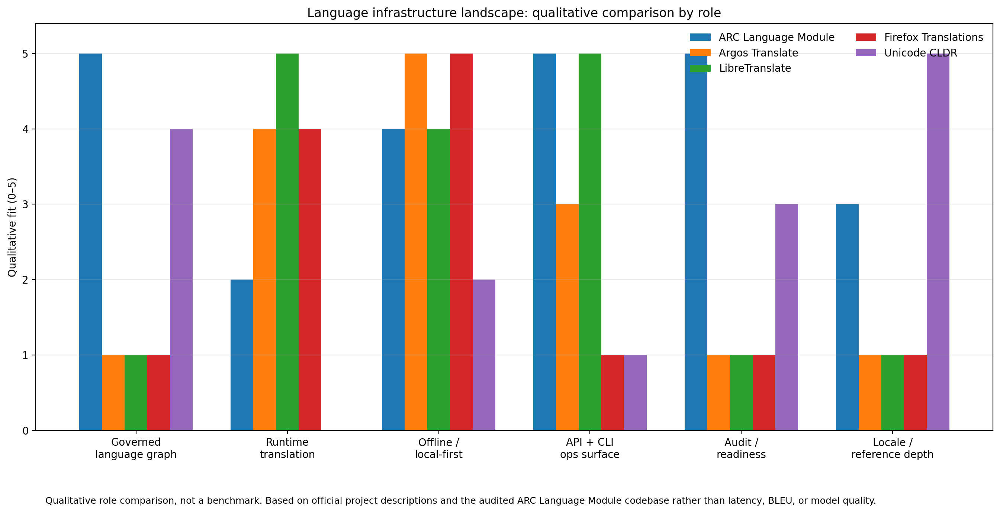

# ARC Language Module

<p align="center">
  <a href="https://github.com/sponsors/GareBear99"></a>
  
  
  
  
  
</p>

A **governed multilingual backend foundation** for future AI systems.

ARC Language Module is **not just a translator**. It is a language knowledge engine that helps an AI system know:

- what languages it has data for
- what scripts, variants, pronunciation hints, and lineage relationships exist
- what it can actually translate right now
- what still depends on external providers or corpora
- what was seeded, imported, changed, or left unresolved

That makes it a better fit for **serious AI infrastructure** than projects that only expose a translation endpoint.

## At-a-glance feature fit

This table is here to make the repo's niche obvious fast: **ARC Language Module is best when you need a governed language backend, not just a translator endpoint.**

| Capability / fit | ARC Language Module | Argos Translate | LibreTranslate | Firefox Translations / Bergamot | Unicode CLDR |
|---|---|---|---|---|---|
| Structured language graph | **Yes — core strength** | Limited | Limited | No | **Yes — locale/reference focused** |
| Runtime translation | Partial / routed | **Yes — core strength** | **Yes — core strength** | **Yes — browser focused** | No |
| Offline / local-first operation | **Yes** | **Yes** | **Yes** | **Yes** | Data/library dependent |
| API surface | **Yes** | Limited / wrapper dependent | **Yes — core strength** | No public ops API focus | No |
| CLI / operator workflows | **Yes** | **Yes** | Limited admin focus | No | Limited tooling focus |
| Coverage / readiness matrix | **Yes — core strength** | No | No | No | Partial via locale coverage |
| Provenance / governed ingestion | **Yes — core strength** | No | No | No | Contributor/repository process, not runtime governance |
| Release / evidence snapshots | **Yes** | No | No | No | No |
| Best used for | **AI language substrate, multilingual control plane, governed routing** | Offline translation library | Self-hosted translation API | Private browser/page translation | Locale data and internationalization reference |
| Stronger than ARC at | Auditability, routing, graph modeling | Raw offline MT packaging | Simple translation API deployment | Seamless in-browser page translation | Breadth of locale standards/reference data |
| Stronger than others at | **Governed language infrastructure** | Offline MT inference | Translation API simplicity | Browser-native private translation | Standards/reference ecosystem depth |

### Quick read of the table

- Choose **ARC Language Module** when you need to know **what languages you support, how well you support them, what data you have, what runtime paths exist, and what changed over time**.
- Choose **Argos Translate** when you mainly want **local/offline translation models**.
- Choose **LibreTranslate** when you mainly want **a translation API you can self-host quickly**.
- Choose **Firefox Translations / Bergamot** when you mainly want **private, on-device browser translation**.
- Choose **Unicode CLDR** when you mainly want **locale/reference data for i18n and formatting**.

---

## What this repo is, in plain English

Think of this as the **brain + filing system + traffic controller** behind a multilingual AI stack.

It gives you:

- a **language graph** stored in SQLite
- a **CLI and API** for operators and applications
- **seeded language knowledge** you can inspect and extend
- **runtime routing** that separates “we know this language” from “we can translate or speak it right now”
- **coverage, readiness, and policy surfaces** so unsupported paths are visible instead of hidden
- **evidence and release snapshots** so the package can explain what it contains and what it claims

If you want a one-line summary:

> ARC Language Module is a production-track substrate for AI systems that need structured multilingual knowledge, honest capability tracking, and controlled routing between data and runtime providers.

---

## What it can do today

### 1) Store structured language knowledge
It keeps language records in a real database rather than loose notes or hardcoded conditionals.

That includes things like:

- language records
- aliases and alternate names
- scripts
- lineage / family relationships
- variants (dialects, registers, orthographies, historical stages)
- pronunciation profiles
- broad phonology hints
- transliteration profiles
- seeded phrase translations
- capability/readiness records

### 2) Tell you what the system actually knows
It can answer practical questions such as:

- Which languages are loaded?
- Which scripts are attached to each language?
- Which languages have pronunciation or phonology profiles?
- Which surfaces are seeded versus missing?
- Which capabilities are production, reviewed, experimental, or absent?

### 3) Route translation requests honestly
This repo does not pretend that every language is fully runtime-ready.

It can route a request through:

- seeded local phrase support
- optional local/runtime providers
- external provider bridges
- explicit “not ready” or “gap” states

That makes it a **language operations layer**, not just a translator wrapper.

### 4) Support operator workflows
The CLI/API surfaces can be used for:

- coverage reports
- implementation/readiness matrices
- policy snapshots
- acquisition workspace planning
- import validation
- evidence bundle exports
- release integrity checks

### 5) Ingest and govern new language data
The package supports dry-run-safe ingestion and provenance-aware updates, so new datasets can be staged and checked instead of blindly merged.

### 6) Governed self-fill lane
The module can now scan itself for missing surfaces, stage structured self-fill candidates, and promote them into canonical tables with receipts instead of mutating truth silently.

---

## What it is not

To keep claims honest, this package is **not**:

- a universal best-in-class machine translation model
- a finished speech/TTS stack
- a complete transliteration engine for every script pair
- a giant cloud service by itself

It is strongest when used as a **multilingual control layer** inside a larger AI product or research stack.

---

## Why this matters for future AI

Most language projects specialize in one narrow slice:

- translation only
- locale/reference data only
- browser translation only
- API hosting only

Future AI systems need more than that.

They need to know:

- what language knowledge they own
- what runtime tools are available
- which paths are trustworthy
- what support is partial or missing
- how to ingest better data without losing provenance
- how to expose all of this to both humans and software

That is the lane ARC Language Module is trying to lead:

> not “best translator in the world,” but **best governed language substrate for future AI systems that need multilingual memory, routing, readiness, and auditability**.

---

## Where it sits compared to other projects

Different projects solve different problems well.

- **Argos Translate** is strong for offline open-source translation packages.
- **LibreTranslate** is strong for self-hosted translation APIs.
- **Firefox Translations / Bergamot** is strong for local in-browser translation.
- **Unicode CLDR** is strong for locale/reference data used across software ecosystems.
- **ARC Language Module** is strongest as the **governed orchestration layer** that sits above or beside those kinds of tools.

### Qualitative comparison by role

> This is a **role comparison**, not a latency or BLEU benchmark.



### Comparison table

| Project | Primary strength | Best use case | What it does not focus on |
|---|---|---|---|
| **ARC Language Module** | Governed multilingual substrate | AI backends that need language knowledge + routing + readiness + auditability | Being a single best MT engine |
| **Argos Translate** | Offline open-source translation | Local translation packages and desktop/local workflows | Broader governance / language graph surfaces |
| **LibreTranslate** | Self-hosted translation API | Drop-in translation endpoints and private deployment | Rich language-knowledge modeling |
| **Firefox Translations / Bergamot** | Private on-device browser translation | Website translation inside the browser | Operator-facing language registry and ingestion governance |
| **Unicode CLDR** | Locale/reference data | Internationalization, formatting, display names, locale metadata | Runtime translation orchestration |

For a more explicit comparison, see [`docs/COMPETITOR_COMPARISON.md`](docs/COMPETITOR_COMPARISON.md).

---

## Seed and package snapshot

Current release-integrity snapshot from the repo's single-source version path:

| Surface | Count |
|---|---:|
| Version | 0.27.0 |
| Languages | 35 |
| Phrase translations | 385 |
| Language variants | 104 |
| Language capabilities | 245 |
| Pronunciation profiles | 35 |
| Phonology profiles | 35 |
| Transliteration profiles | 21 |
| Semantic concepts | 30 |
| Concept links | 46 |

> Provider support is intentionally modeled separately from core graph truth. Runtime provider availability depends on what is installed, registered, and enabled in the target environment.

---

## Quick start

```bash
pip install -e .

PYTHONPATH=src python -m arc_lang.cli.main init-db
PYTHONPATH=src python -m arc_lang.cli.main seed-common-languages
PYTHONPATH=src python -m arc_lang.cli.main stats
PYTHONPATH=src python -m arc_lang.cli.main coverage-report
PYTHONPATH=src python -m arc_lang.cli.main system-status
PYTHONPATH=src python -m arc_lang.cli.main build-implementation-matrix
PYTHONPATH=src python -m arc_lang.cli.main release-snapshot
```

---

## Example operator questions this repo can answer

- What languages are in the graph right now?
- Which ones are missing transliteration or pronunciation support?
- Which variants exist for a given language?
- What translation/assertion data came from which source?
- Which capabilities are seeded, reviewed, experimental, or production?
- What changed between releases?
- Which providers are needed for a requested runtime path?

---

## Architecture at a glance

The project is split into clear layers:

- `core/` — config, db, models
- `services/` — language logic, ingestion, routing, policy, evidence, coverage
- `api/` — FastAPI surface grouped by concern
- `cli/` — operator entrypoints and handlers
- `config/` — seed manifests and curated inputs
- `sql/` — schema and indexes
- `docs/` — architecture, runtime, policy, onboarding, and comparison docs

Deep dives:

- [`docs/ARCHITECTURE.md`](docs/ARCHITECTURE.md)
- [`docs/RUNTIME_ORCHESTRATION.md`](docs/RUNTIME_ORCHESTRATION.md)
- [`docs/POLICY_AND_EVIDENCE.md`](docs/POLICY_AND_EVIDENCE.md)
- [`docs/IMPLEMENTATION_MANIFESTS_AND_PHONOLOGY.md`](docs/IMPLEMENTATION_MANIFESTS_AND_PHONOLOGY.md)
- [`docs/COMPETITOR_COMPARISON.md`](docs/COMPETITOR_COMPARISON.md)

---

## Release integrity

```bash
PYTHONPATH=src python -m arc_lang.cli.main release-snapshot
```

This emits:

- the package version
- pyproject/version consistency checks
- API health/version integrity checks
- live graph counts for release verification

---

## External dependencies and optional providers

This package can connect to or sit beside external tooling, but does not bundle all of them by default.

| Provider / source | Role |
|---|---|
| Argos Translate | Local neural MT option |
| NLLB-style external inference | Large-scale MT bridge path |
| PersonaPlex-style speech provider | Speech boundary surface |
| Glottolog | External genealogy/reference corpus |
| ISO 639-3 | Authoritative language identifiers |
| CLDR | Script/locale/reference data |

---

## Repository metadata

### Suggested GitHub topics

Use the most specific topics first so the repo lands in the right lane:

```text
multilingual
translation
language-detection
transliteration
pronunciation
phonology
natural-language-processing
multilingual-nlp
knowledge-graph
language-technology
fastapi
sqlite
cli
api
governance
auditability
orchestration
local-first
offline-first
artificial-intelligence
```

### Suggested GitHub About text

> Governed multilingual language-ops substrate for AI systems: language knowledge, provider routing, auditability, readiness, CLI, and API.

### Short promotional line

> A control layer for multilingual AI systems, not just a translator.

---

## Support the project

If this repo is useful to you:

- Star the repository
- Open issues for bugs, corpus gaps, or runtime/provider edge cases
- Send pull requests for new language data, provider integrations, or hardening work
- Share it with people building multilingual AI, localization systems, or language tools
- Support development on [GitHub Sponsors](https://github.com/sponsors/GareBear99)

---

## Release and validation status

Current production-track validation for this codebase includes:

- **336 passing tests**
- wheel and sdist build verification
- installed-wheel smoke validation
- FastAPI app-load verification
- CLI help / release snapshot verification

These checks support the repo's current positioning as a **production-track language infrastructure package**, while real-world deployment quality still depends on the target environment, provider integrations, telemetry, and soak testing.

---

## License

This project is intended to ship under the **MIT License**. Add a root `LICENSE` file in the public repository so the visible GitHub repo matches the package metadata.


## Governed self-fill arbitration

The module now supports approved-source staging, live source authority weighting, candidate merge arbitration, and threshold-based promotion receipts. See `docs/SELF_FILL_AUTHORITY_ARBITRATION.md`.
