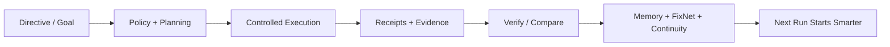
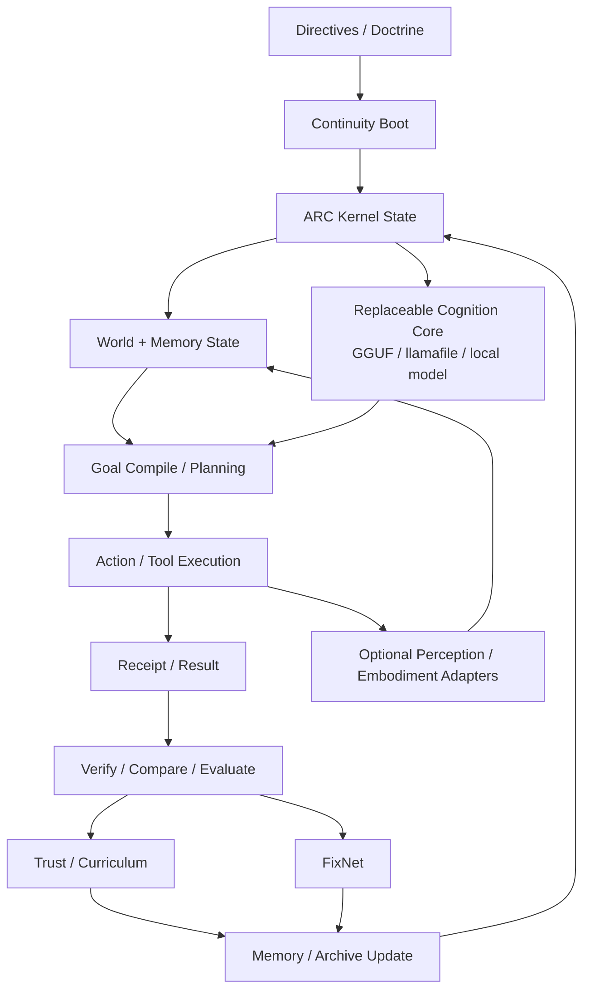
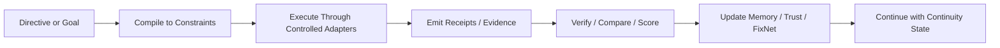
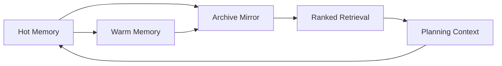
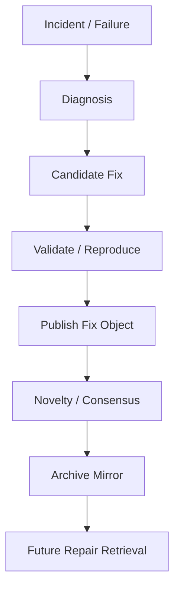
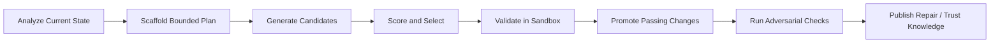

# ARC Lucifer Cleanroom Runtime

[](#validation)
[](#quick-start)
[](LICENSE.md)


  <a href="https://github.com/sponsors/GareBear99"></a>
  <a href="https://buymeacoffee.com/garebear99"></a>


Deterministic local-first AI operator runtime with receipts, replay, rollback, ranked memory, bounded self-improvement, and optional perception, bluetooth, mapping, and robotics adapters.

ARC Lucifer Cleanroom Runtime is a Python runtime for building a **persistent local AI shell** around a replaceable model backend such as llamafile / GGUF-oriented workflows. It is designed around continuity, auditability, policy-aware execution, and durable state instead of disposable chat sessions or cloud-only orchestration.

This repo is strongest when you want:
- a governed local runtime instead of a one-shot chat wrapper
- receipts, replay, rollback, and inspectable state transitions
- persistent directives, memory tiers, archive lineage, and repair intelligence
- exact code-editing and self-improvement scaffolding under bounded validation
- a clean path to attach optional multimodal, bluetooth, mapping, and robotics layers without making them mandatory for every install

| Dimension | ARC Lucifer Cleanroom Runtime | Typical agent wrapper |
|---|---|---|
| Core identity | Persistent operator runtime | Session/chat wrapper |
| State model | Receipts, replay, rollback, continuity | Mostly transcript-based |
| Memory | Tiered + archive lineage | Often shallow or ad hoc |
| Repair intelligence | FixNet lineage and reuse | Usually manual notes or none |
| Code editing | Exact line/symbol grounded flows | Often best-effort patching |
| Optional embodiment | Attached through bounded adapters | Often absent or bolted on |
| Install philosophy | Local-first core, extras optional | Frequently cloud-first or dependency-heavy |


The honest strongest claim today is:

“A serious open-source continuity-first runtime foundation with real receipts, replay/rollback, directive persistence, bounded action policy, and self-improvement scaffolding.”

## Plain-English use case

Think of this repo as a **local AI operations shell** that does not forget its rules every time the model stops talking.

Instead of only producing text, the runtime can:
- take a directive or goal
- compile it into bounded actions
- execute through controlled adapters
- emit receipts and evidence for what happened
- verify the result
- preserve memory, repair knowledge, and continuity for the next run

A practical example is a local coding/runtime operator that can inspect state, apply a grounded code edit, validate the result, roll back if needed, and retain the outcome as reusable operational knowledge instead of burying it in a transient chat log.

## At-a-glance runtime flow



## Table of contents

- [What this repo is](#what-this-repo-is)
- [What it does today](#what-it-does-today)
- [What it is not](#what-it-is-not)
- [Plain-English use case](#plain-english-use-case)
- [At-a-glance runtime flow](#at-a-glance-runtime-flow)
- [15-second example](#15-second-example)
- [Start here in 60 seconds](#start-here-in-60-seconds)
- [Capability matrix](#capability-matrix)
- [Why it exists](#why-it-exists)
- [Architecture snapshot](#architecture-snapshot)
- [Repository layout](#repository-layout)
- [First commands to run](#first-commands-to-run)
- [CLI command surface](#cli-command-surface)
- [Examples to run first](#examples-to-run-first)
- [Memory and archive model](#memory-and-archive-model)
- [FixNet repair intelligence](#fixnet-repair-intelligence)
- [Self-improvement workflow](#self-improvement-workflow)
- [Optional adapters and embodiment](#optional-adapters-and-embodiment)
- [Validation](#validation)
- [Documentation index](#documentation-index)
- [Comparison snapshot](#comparison-snapshot)
- [Production posture](#production-posture)
- [Implementation truth matrix](#implementation-truth-matrix)
- [SEO and discoverability notes](#seo-and-discoverability-notes)
- [License](#license)

## What this repo is

ARC Lucifer Cleanroom Runtime is a **persistent local operator runtime** built around a deterministic operational spine:
- directives and continuity state survive past a single model run
- actions emit receipts, traces, and replayable state transitions
- memory stays structured across hot, warm, and archive tiers
- fixes can become reusable repair knowledge instead of disappearing into logs
- model backends stay replaceable instead of becoming the sole source of truth

It combines a durable runtime spine with:
- ARC kernel state and policy handling
- CLI and operator routing
- memory retention and ranked retrieval
- code editing with exact line and symbol grounding
- self-improvement analysis, candidate generation, validation, and promotion
- FixNet repair lineage and archive mirroring
- optional perception, voice, mapping, bluetooth, geo, and robotics surfaces

## 15-second example

```text
Operator: verify src/lucifer_runtime/runtime.py and patch the failing guard path
Runtime:
  1. loads directives and continuity state
  2. inspects the target file through bounded tools
  3. proposes an exact grounded edit
  4. records a receipt before and after the change
  5. verifies the result
  6. can roll back if validation fails
  7. stores the fix outcome in memory / repair lineage
```

## What it does today

Current package state in this repository includes:
- persistent SQLite-backed kernel state
- deterministic file, shell, and code-edit operator flows
- exact line-range and symbol-grounded Python code editing
- managed local-model execution through llamafile-oriented flows
- rollback, replay, evaluations, policy decisions, and fallback histories
- hot, warm, and archive memory tiers with early archive mirroring and ranked search
- self-improvement analysis, planning, scaffolding, candidate generation, scoring, review, promotion, and adversarial fault injection
- goal compilation into constraints, invariants, abort conditions, evidence requirements, and archive mode
- shadow predicted-vs-actual comparison flows
- tool trust tracking and curriculum-memory updates
- directive ledger, continuity boot receipts, heartbeats, and primary/fallback mode tracking
- FixNet repair intelligence with semantic fix lineage and archive-visible mirrors
- operator commands for monitor, info, doctor, export/import, backup, compact, and failures
- optional bounded robotics bridge, bluetooth bridge, mapping, spatial truth, and geo overlay layers
- docs, examples, tests, packaging metadata, smoke scripts, release checks, and public GitHub repo surfaces

## What it is not

This repository is **not**:
- a claim of solved AGI
- a turnkey robotics product
- a cloud agent platform pretending to be local-first
- a fake multimodal demo with undocumented hard dependencies
- a fully finished production installer stack

It is a real runtime foundation with a strong architectural spine, an honest implementation boundary, and a clear path for attaching richer capability layers over time.

## Start here in 60 seconds

### 1. Create a virtual environment

```bash
python3 -m venv .venv
source .venv/bin/activate
python -m pip install -U pip
```

### 2. Install the repo in editable mode

```bash
python -m pip install -e .[dev]
```

### 3. Run validation

```bash
pytest -q
bash scripts/smoke.sh
```

### 4. Inspect the command surface

```bash
PYTHONPATH=src python -m lucifer_runtime.cli commands
```

### 5. Run the first example

```bash
PYTHONPATH=src python examples/run_runtime.py
```

### Optional make shortcuts

```bash
make install
make test
make smoke
make release-check
```

## Capability matrix

| Area | Status | Notes |
|---|---|---|
| Core runtime | Implemented | Persistent local operator runtime with receipts, replay, rollback, directives, and continuity state |
| CLI operator surface | Implemented | Read, write, delete, shell, prompt, approve, reject, rollback, trace, export/import, state, monitor, doctor |
| Code editing | Implemented | Exact range replacement, symbol-aware edits, indexing, verification, edit planning |
| Memory tiers | Implemented | Hot, warm, archive, early mirroring, ranked search |
| FixNet | Implemented | Repair lineage, novelty checks, archive mirrors, stats, sync surfaces |
| Self-improvement scaffolding | Implemented | Analyze, plan, scaffold, validate, patch, score, promote, adversarial cycles |
| Model backend support | Implemented | Replaceable model profile handling with llamafile-oriented flows and local stub paths |
| Spatial truth | Implemented | Structured observations, anchors, confidence summaries |
| Bluetooth bridge | Optional | Trusted-device doctrine, bounded signal and action paths |
| Robotics bridge | Optional | Bounded action model with deterministic safety checks |
| Mapping / geo overlay | Optional | Occupancy-grid routing, anchors, tile summaries |
| Perception / voice | Optional | Adapters and loops exist, but depend on extra packages and target stack choices |
| Production soak / installers | In progress | Repo has scripts and docs, but not a completed signed installer pipeline |

## Why it exists

Most public agent systems optimize for fast coding productivity, cloud workflows, or short-lived interactive sessions.

This repository is aimed at a different center of gravity:

> a persistent, directive-bound, local-first runtime with a replaceable reasoning core and a deterministic operational spine

The runtime identity comes from directives, doctrine, runtime state, memory lineage, repair lineage, and the attached cognition/model layer. That means continuity does not disappear when one model run ends.

## Architecture snapshot



### Runtime flow



The important distinction is that the runtime is not built around a single opaque transcript. It is built around bounded actions, receipts, state transitions, and continuity.

## Repository layout

```text
src/
  arc_kernel/           core event, policy, state, replay, rollback logic
  lucifer_runtime/      CLI, router, runtime config, command surfaces
  cognition_services/   directives, goals, planner, evaluator, shadow, trust
  memory_subsystem/     memory tiers, ranking, archival behavior
  self_improve/         analysis, candidate generation, scoring, review, promotion
  code_editing/         line/symbol grounded patch workflows
  fixnet/               repair lineage, novelty filtering, fix archive mirrors
  verifier/             verification and health surfaces
  dashboards/           monitor and trace visualization helpers
  model_services/       model-profile and local model integration surfaces
  perception_adapters/  optional vision/audio/voice adapter contracts
  bluetooth_bridge/     trusted bluetooth policies and bounded action surfaces
  robotics_bridge/      bounded robotics doctrine and mock action surfaces
  robotics_mapping/     local occupancy-grid mapping and route planning
  spatial_truth/        canonical spatial observation and anchor state
  geo_overlay/          local anchor-vault and tile summary surfaces
  resilience/           fallback, continuity, and runtime hardening helpers

docs/                   architecture, comparisons, readiness, retention docs
examples/               runnable examples for runtime, memory, loop, voice, spatial
scripts/                bootstrap, smoke, soak, and release-check helpers
tests/                  automated validation coverage
assets/                 public preview assets
```

## First commands to run

These are the fastest commands for understanding the repo as a runtime instead of just reading source code.

### Runtime and health

```bash
PYTHONPATH=src python -m lucifer_runtime.cli commands
PYTHONPATH=src python -m lucifer_runtime.cli state
PYTHONPATH=src python -m lucifer_runtime.cli info
PYTHONPATH=src python -m lucifer_runtime.cli doctor
PYTHONPATH=src python -m lucifer_runtime.cli monitor --watch 2 --iterations 5
PYTHONPATH=src python -m lucifer_runtime.cli failures
```

### Persistence, replay, and repair

```bash
PYTHONPATH=src python -m lucifer_runtime.cli export runtime-export.json
PYTHONPATH=src python -m lucifer_runtime.cli backup backups/
PYTHONPATH=src python -m lucifer_runtime.cli compact
PYTHONPATH=src python -m lucifer_runtime.cli fixnet stats
PYTHONPATH=src python -m lucifer_runtime.cli fixnet register --title "retry timeout patch" --summary "Stabilize retry path after timeout classification"
```

### Memory and directives

```bash
PYTHONPATH=src python -m lucifer_runtime.cli memory status
PYTHONPATH=src python -m lucifer_runtime.cli memory search "fallback retry"
PYTHONPATH=src python -m lucifer_runtime.cli directive add "stay local-first"
PYTHONPATH=src python -m lucifer_runtime.cli directive stats
PYTHONPATH=src python -m lucifer_runtime.cli continuity status
```

### Code and self-improvement

```bash
PYTHONPATH=src python -m lucifer_runtime.cli code verify src/lucifer_runtime/runtime.py
PYTHONPATH=src python -m lucifer_runtime.cli self-improve analyze
PYTHONPATH=src python -m lucifer_runtime.cli self-improve plan
PYTHONPATH=src python -m lucifer_runtime.cli self-improve review-run --run-id latest
```

## CLI command surface

The command surface is deeper than a standard toy shell. Current top-level command groups include:

- file operators: `read`, `write`, `delete`, `shell`
- controlled model/runtime actions: `prompt`, `approve`, `reject`, `rollback`
- code editing: `code index`, `code verify`, `code plan`, `code replace-range`, `code replace-symbol`
- state and diagnostics: `trace`, `export`, `import`, `info`, `monitor`, `failures`, `doctor`, `state`, `bench`
- runtime config and models: `config`, `model`, `train`
- self-improvement: `self-improve analyze`, `plan`, `scaffold`, `validate-run`, `generate-candidates`, `score-candidates`, `execute-cycle`, `promote`, `adversarial-cycle`
- repair, trust, and curriculum: `fixnet`, `trust`, `curriculum`
- continuity and directives: `directive`, `continuity`, `goal`, `shadow`, `memory`
- optional capability packs: `robot`, `mapping`, `spatial`, `bt`, `geo`

To see the live command surface on your machine:

```bash
PYTHONPATH=src python -m lucifer_runtime.cli commands
```

## Examples to run first

The examples folder gives the easiest path to understanding the repo in motion.

Recommended first pass:

```bash
PYTHONPATH=src python examples/run_runtime.py
PYTHONPATH=src python examples/run_memory_retention.py
PYTHONPATH=src python examples/run_persistent_loop.py
```

Other useful examples:
- [`examples/run_cognition_loop.py`](examples/run_cognition_loop.py) for cognition-oriented control flow
- [`examples/run_llamafile_stream.py`](examples/run_llamafile_stream.py) for local-model execution
- [`examples/run_perception_loop.py`](examples/run_perception_loop.py) for optional perception adapter flow
- [`examples/run_personaplex_voice.py`](examples/run_personaplex_voice.py) for optional voice integration
- [`examples/spatial_truth_demo.py`](examples/spatial_truth_demo.py) for spatial truth handling
- [`examples/arc_lucifer_3d_cognitive_model.html`](examples/arc_lucifer_3d_cognitive_model.html) for a visual concept surface

## Memory and archive model

The memory subsystem is one of the repo’s defining pieces.

It supports:
- live memory for active operational context
- warm memory for retained but lower-priority context
- archive memory for durable long-term lineage
- early archive mirroring before final retirement
- ranked search back into retained memory
- readable metadata instead of opaque vector-only storage



Relevant docs:
- [Memory retention](docs/memory_retention.md)
- [Memory mirror and stack](docs/v2_4_memory_mirror_and_stack.md)
- [Memory ranking notes](docs/v2_5_memory_ranking_notes.md)

## FixNet repair intelligence

FixNet is the repair-intelligence layer. Instead of treating fixes as disposable notes, the runtime can preserve them as reusable repair objects with lineage.

That includes:
- semantic fix entries
- novelty checks to avoid duplicate noise
- consensus-oriented publication logic
- archive mirrors for long-term retention
- runtime visibility into what has already worked before



Relevant docs:
- [FixNet archive embedding](docs/v2_9_1_fixnet_archive_embedding.md)
- [Resilience and operator comments](docs/v2_2_resilience_and_comments.md)

## Self-improvement workflow

The self-improvement system is intentionally constrained. It is meant to improve within a deterministic process rather than mutate itself blindly.



High-level cycle:
1. analyze the current state
2. scaffold a bounded plan
3. generate candidate changes
4. score the candidates
5. validate in a sandbox
6. promote only passing work
7. run adversarial or fault-injection checks on promoted paths

Relevant source areas:
- [`src/self_improve/`](src/self_improve)
- [`src/code_editing/`](src/code_editing)
- [`src/verifier/`](src/verifier)

## Optional adapters and embodiment

This repo makes the contract explicit:
- cameras, microphones, simulators, and robot SDKs are **not required** to install the core runtime
- when enabled, those layers should attach through bounded adapter interfaces
- structured observations should feed the same deterministic shell instead of bypassing it
- the model should reason over summarized state and observations, not own raw millisecond motor control

### Optional capability packs

| Extra | Install |
|---|---|
| Dev tools | `python -m pip install -e .[dev]` |
| Bluetooth bridge | `python -m pip install -e .[bluetooth]` |
| Vision | `python -m pip install -e .[vision]` |
| Audio | `python -m pip install -e .[audio]` |
| Robotics helpers | `python -m pip install -e .[robotics]` |
| Embodiment helpers | `python -m pip install -e .[embodiment]` |
| Full perception stack | `python -m pip install -e .[full]` |
| Faster speech stack | `python -m pip install -e .[audio-fast]` |
| Voice runtime | `python -m pip install -e .[voice]` |

See:
- [Optional vision/runtime adapters](docs/vision_runtime_optional_adapters.md)
- [Perception adapters implementation](docs/perception_adapters_implementation.md)
- [Bluetooth bridge](docs/bluetooth_bridge.md)
- [Spatial truth](docs/spatial_truth.md)
- [Geo overlay](docs/geo_overlay.md)

## Validation

This repository includes real validation surfaces:
- 84 test files under [`tests/`](tests)
- smoke validation under [`scripts/smoke.sh`](scripts/smoke.sh)
- release validation under [`scripts/release_check.sh`](scripts/release_check.sh)
- soak harness materials under [`scripts/soak.py`](scripts/soak.py) and [docs/SOAK.md](docs/SOAK.md)
- package build support through `python -m build`

Recommended verification flow:

```bash
pytest -q
bash scripts/smoke.sh
python -m build
bash scripts/release_check.sh
```

## Documentation index

### Start here
- [Documentation hub](docs/INDEX.md)
- [Architecture](docs/architecture.md)
- [Doctrine](docs/doctrine.md)
- [Public direction](docs/public_direction.md)

### Runtime, model, and perception
- [llamafile flow](docs/llamafile_flow.md)
- [Control loops](docs/v2_10_control_loops.md)
- [Model profiles and training](docs/v2_9_model_profiles_and_training.md)
- [Optional vision/runtime adapters](docs/vision_runtime_optional_adapters.md)
- [Perception adapters implementation](docs/perception_adapters_implementation.md)

### Memory, archive, and continuity
- [Memory retention](docs/memory_retention.md)
- [Memory mirror and stack](docs/v2_4_memory_mirror_and_stack.md)
- [Memory ranking notes](docs/v2_5_memory_ranking_notes.md)

### Self-improvement, repair, and trust
- [Self-improvement runs](docs/v2_0_self_improve_runs.md)
- [Autonomous patch cycle](docs/v2_3_autonomous_patch_cycle.md)
- [Candidate cycles](docs/v2_6_candidate_cycles.md)
- [Adversarial cycles](docs/v2_7_adversarial_cycles.md)
- [FixNet archive embedding](docs/v2_9_1_fixnet_archive_embedding.md)

### Release and public-facing docs
- [Benchmarks](docs/benchmarks.md)
- [Production readiness](docs/production_readiness.md)
- [Release checklist](docs/RELEASE_CHECKLIST.md)
- [Migration plan](docs/migration_plan.md)
- [Source comparison](docs/source_comparison.md)
- [Repo SEO notes](docs/REPO_SEO.md)

## Comparison snapshot

This repo is strongest where you want a governed, inspectable, local runtime with continuity and durable operational intelligence.

| Dimension | ARC Lucifer Cleanroom Runtime | Typical agent wrapper |
|---|---|---|
| Core identity | Persistent operator runtime | Session/chat wrapper |
| State model | Receipts, replay, rollback, continuity | Mostly transcript-based |
| Memory | Tiered + archive lineage | Often shallow or ad hoc |
| Repair intelligence | FixNet lineage and reuse | Usually manual notes or none |
| Code editing | Exact line/symbol grounded flows | Often best-effort patching |
| Optional embodiment | Attached through bounded adapters | Often absent or bolted on |
| Install philosophy | Local-first core, extras optional | Frequently cloud-first or dependency-heavy |

## Production posture

Current honest state:
- the repository is a strong, real software foundation
- the runtime architecture is well beyond a toy demo
- the package is suitable for local technical evaluation and public GitHub review
- the command surface, docs, tests, and examples make the repo inspectable today

Still outside repo-only completion:
- long-run soak validation on target hardware
- broader model-quality benchmarking across attached backends
- signed installers and polished packaging UX
- richer runtime screenshots and terminal/demo captures
- hardware-specific adapter validation on chosen real devices

## Implementation truth matrix

See [docs/IMPLEMENTATION_MATRIX.md](docs/IMPLEMENTATION_MATRIX.md) for the hard split between live, bounded, optional, experimental, and planned capability claims.

## SEO and discoverability notes

This README intentionally uses truthful search phrases people actually search for, including:
- local AI runtime
- GGUF agent framework
- deterministic AI operator
- persistent AI shell
- terminal AI runtime
- local coding agent foundation
- replayable AI workflow engine
- archival memory system for AI agents
- self-improving local agent architecture
- clean-room operator runtime for Python

That improves discoverability without inflating the actual implementation boundary.

## License

Released under the MIT License. See [LICENSE.md](LICENSE.md).
